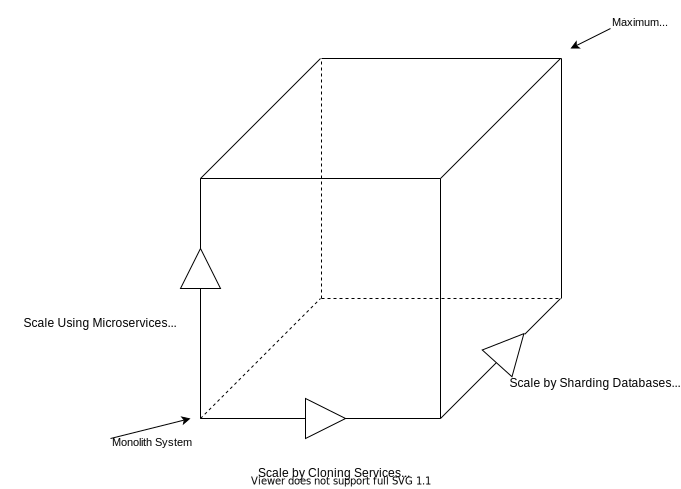
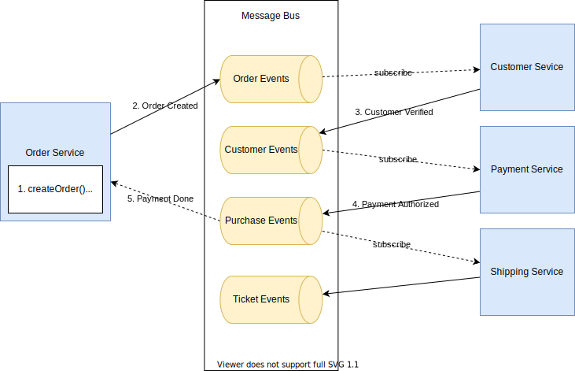

## Microservices vs Monoliths

When we start a new application, the monolith architecture offers a lots of benefits being simple to develop, test and deploy.
However, over time, as new features are added in each sprint, the code base become larger. 
As the product becomes successful, the development team will also grow, maybe even to multiple teams, each focussing on a feature.
Now the development slows down because 
* the application is too complex for new developers to understand, bug-fixes require cross team coordination.
* implementation of new features is slow, the build process takes forever.
* deploying changes to production is now a long and painful process. Friday deployments and the resulting weekend calls lead to overall frustration and eventual blame passing
* The monolithic architecture also makes it difficult to adopt new frameworks and languages, because it will involve a very expensive complete re-write.


Microservices are an emerging trend with tech leaders like Netflix, Amazon, Google successfully switching from monolith architecture to microservices.
Indeed, microservices offer tangible benefits like scalability, flexibility, agile, whereas monoliths poses a number of challenges associated with handling a huge codebase, adopting new technologies, scaling and deployment among others.

>In short, the microservice architectural style is an approach to developing a single application as a suite of small services, each running in its own process and communicating with lightweight mechanisms, often an HTTP resource API.
> -Martin Fowler

The book ["The Art of Scalability"](http://theartofscalability.com/) describes a really useful, three dimension scalability model: the scale cube.



The scale cube is a technology model that indicates three methods (or approaches) by which technology platforms may be scaled to meet increasing levels of demand upon the system in question:
* X-axis scaling  works by replication or cloning the monolith behind a load balancer, 
* Z-axis scaling also runs multiple instances of the monolith application, but unlike X-axis scaling, each instance is responsible for only a subset of the data. 
  The router in front of the instances uses a request attribute to route it to the appropriate instance. An application might, for example, route requests using userId.
* Y-axis scaling works by splitting the monolith into a set of services.

The microservice architecture uses services as the unit of modularity. 
* Each service has an API, which is an impermeable boundary that is difficult to violate. 
* Loosely coupled with other services - enables a team to work independently the majority of time on their service(s) without being impacted by changes to other services and without affecting other services
* Independently deployable - enables a team to deploy their service without having to coordinate with other teams

Services communicate using either synchronous protocols such as HTTP/REST or asynchronous protocols such as AMQP. 
Services can be developed and deployed independently of one another. 
Each service has its own database in order to be decoupled from other services.


## Microservices and SOA

At a very high level, SOA and the microservice architecture are architectural styles that structure a system as a set of services
However, there are significant differences between them

|   | Microservices | SOA |
|---|---|---|
|Inter-service Communication | Microservices use Dumb pipes, such as message brokers, or direct service to service communication using REST or gRPC | SOA uses Smart Pipes such as Enterprise Service Bus, SOAP and other WS* standards |
| Data | Microservices generally use database per service | SOA uses a Global data model and shared databases |
 
Traditionally, SOA involves an **enterprise service bus (ESB)** as a means of coordinating and controlling these services.
Microservice architecture is generally considered an evolution of SOA as its services are more fine-grained, and function independently of each other. 


## Benefits of Microservices Architecture
The microservice architecture has the following benefits:
* Services are small and easier to maintain
* Services are independently deployable
* Services are independently scalable
* It enables continuous delivery and deployment of a large application
* It has better fault tolerance
* Microservices allow easier experimentation and adoption of new technologies


## Drawbacks of Microservices Architecture
No technology is a silver bullet, microservices also have a development overhead.
* Developers must deal with the additional complexity of creating a distributed system:
* Developers must implement the inter-service communication mechanism and deal with partial failure
* Implementing requests that span multiple services is more difficult
* Testing the interactions between services is more difficult
* Implementing requests that span multiple services requires careful coordination between the teams


## There are only two hard problems in distributed systems:  
```
 2. Exactly-once delivery   
 1. Guaranteed order of messages   
 2. Exactly-once delivery
```


## How to implement Microservices

When choosing to implement microservices, we face the following questions

#### 1. How do we partition the system into microservices
Ideally each service should have a small set of responsibilities. When selecting the services to implement we can either
 * Decompose by **business capabilities**, eg. Order Management, Customer Management, Vendor Management
 * Decompose by **domain driven design**, by dividing the domain into subdomains like Order Taking Subdomain, Delivery subdomain, Accounting subdomain 

#### 2. How do we maintain data consistency between services
Since our services are loosely coupled, each service could have its own database. How do we now maintain data consistency between the services.  
Here we can use the SAGA pattern, where-in, a service publishes an event when its data changes, while downstream services listen for this event and update their data.

##### SAGA Pattern
A saga is a sequence of local transactions which updates its database and publishes a message or event to trigger the next local transaction in the saga. 
If a local transaction fails because it violates a business rule, then the saga executes a series of compensating transactions that undo the changes that were made by the preceding local transactions.


There are two ways of coordination sagas:  
**Choreography** - each local transaction publishes domain events that trigger local transactions in other services  
**Orchestration** - an orchestrator tells the participants what local transactions to execute  

###### Choreography Saga


###### Orchestration Saga


| Choreography | Orchestration |
|---|---|
| Good for simple workflows | Used for complex workflows with many participants or new participants get added over time| 
| Risk of cyclic dependency | No risk of cyclic dependency, however orchestrator becomes Single Point of Failure |
| Difficult to do Integration testing | Design complexity |

SAGA implementation must be capable of handling a set of potential transient failures, and provide idempotence for reducing side-effects and ensuring data consistency.  
Idempotence means that the same operation can be repeated multiple times without changing the initial result. 


For reliably publishing events and updating data we can use
1. Event Sourcing
2. Transaction Outbox
3. Transaction Log Tailing

##### Event Sourcing
Event sourcing persists the state of a business entity such an Order or a Customer as a sequence of state-changing events.   
Whenever the state of a business entity changes, a new event is appended to the list of events.  
Since saving an event is a single operation, it is inherently atomic.  
The application reconstructs an entity’s current state by replaying the events.  

Event sourcing makes it possible to reliably publish events whenever state changes.  
Because it persists events rather than domain objects, it mostly avoids the object‑relational impedance mismatch problem.  
It provides a 100% reliable audit log of the changes made to a business entity by making it possible to implement temporal queries that determine the state of an entity at any point in time.

However, now the query becomes a little more complex, with applications using CQRS (a read only replica of the data) (discussed later) for implementation queries.


##### Transaction Outbox
A service that uses a relational database inserts messages/events into an outbox table (e.g. MESSAGE) as part of the local transaction.   
A service that uses a NoSQL database appends the messages/events to attribute of the record (e.g. document or item) being updated.   
A separate **Polling publisher** publishes the events inserted into database to a message broker.  

Instead of service publishing messages to the Outbox, we can instead implement **Transaction log tailing** to tail the database transaction log


#### 3. How do the clients of a Microservices-based application access the individual services?
Microservices typically provide fine-grained APIs, which means that clients need to interact with multiple services.
For this we generally use lightweight protocols like REST or gRPC

##### REST API
REST stands for **REpresentational State Transfer**. 
It means when a RESTful API is called, the server will transfer to the client a representation of the state of the requested resource.   
For example, when a developer calls Instagram API to fetch a specific user (the resource), the API will return the state of that user, including their name, the number of posts that user posted on Instagram so far, how many followers they have, and more. 
The representation of the state can be in a JSON format, or even XML or HTML format.  
_URL only decides the location. Headers (Accept and Content-Type, etc.) decide the representation. HTTP methods (GET/POST/PUT/DELETE) decide the state transfer._


SOAP stands for **Simple Object Access Protocol**.   
Each SOAP message is contained in an ***envelope*** that includes a header and a body.   
The header may include the message ID and date the message was sent, while the body contains the actual message.  
It is based on XML.   
SOAP defines an envelope format and various rules for describing its contents. SOAP, WSDL and UDDI as one of the three foundation standards of web services.

REST is the way HTTP should be used.  
Today we only use a tiny bit of the HTTP protocol's methods – namely GET and POST. The REST way to do it is to use all of the protocol's methods.  
For example, REST dictates the usage of DELETE to erase a document (be it a file, state, etc.) behind a URI, whereas, with HTTP, you would misuse a GET or POST query like ...product/?delete_id=22.

The main difference between SOAP and REST is the degree of coupling between client and server implementations.   
* A SOAP client works like a custom desktop application, tightly coupled to the server. There's a rigid contract between the client and the server, and everything is expected to break if either side changes anything. You need constant updates following any change, but it's easier to ascertain if the contract is being followed.
* A REST client is more like a browser. It's a generic client that knows how to use a protocol and standardized methods, and an application has to fit inside that. You don't violate the protocol standards by creating extra methods, you leverage on the standard methods and create the actions with them on your media type. If done right, there's less coupling, and changes can be dealt with more gracefully.
* A client is supposed to enter a REST service with zero knowledge of the API, except for the entry point and the media type. 
* In SOAP, the client needs previous knowledge of everything it will be using, or it won't even begin the interaction. Additionally, a REST client can be extended by code-on-demand supplied by the server itself, the classical example being JavaScript code used to drive the interaction with another service on the client-side.


##### gRPC
gRPC is a binary message-based protocol, and this means you’re forced to take an API-first approach to service design.   
You define your gRPC APIs using a Protocol Buffers based IDL, which is Google’s language-neutral mechanism for serializing structured data.   
You use the Protocol Buffer compiler to generate client-side stubs and server-side skeletons.   
Clients and servers exchange binary messages in the Protocol Buffers format using HTTP/2.  
A gRPC API consists of one or more services and request/response message definitions.   
A service definition is analogous to a Java interface and is a collection of strongly typed methods.   

##### GraphQL

GraphQL is a much newer solution than the ones presented before.   

Have you ever had a problem in REST where you needed to implement two separate endpoints returning more simple and more complex responses? If yes then GraphQL is a solution to that.  

From a technical perspective usually it’s a single REST endpoint /graphql taking on input JSON requests with special query DSL. For every query you need to specify, which fields from requested entities should be included in the response.

**Pros:**
* During query it is possible to define which fields should be returned in the response.This allows to query only for data needed for specific view/service.
* Strong typing, resources have predefined schemas
* Supported by many languages
* More and more popular

**Cons:**
* First initial release was in 2015 and a stable one in June 2018, so it’s quite fresh.
* Not all client libraries are already mature
* No HTTP caching support
* Queries always return status code 200

**Example:**
```
type Stock {
  name: String,
  price: String
}

Query:
{
  stock(name: "GOOG") {
    price
  }
}

Response:
{
  "stock": {
    "price": "23.50"
  }
}
```
This means we’re fetching entity stocks by name GOOG and the response should include the field price .


#### 3. How do we implement queries spanning data owned by multiple services.

Since each microservices owns its own database, for implementing queries that need to retrieve data owned by multiple services, we use
* API Composition
* Command Query Responsibility Segregration (CQRS) pattern
* API Gateway
* Service Mesh

##### API Composition

API Composition implements a query operation by invoking services that own the data and combining the results


##### Command Query Responsibility Segregration (CQRS) pattern
With CQRS, we define a view database, which is a **read-only replica** for supporting the queries.  
The application keeps this database updated with subscribing to Domain events published by the services which own the data.

The pattern while being complex, and supporting only **eventual consistency**, does have its benefits including
* Supports multiple denormalized views which are scalable and performant
* Improved separation of concern, leading to simpler command and query models


##### API Gateway
With each microservice, exposing their own endpoints via REST API, we could potentially face the following problems
* The client might need to interact with various services for details of a single product
* Various services might use a diverse set of protocols
* The backend services could change over time, and the client should to be agnostic to those changes.
  
The solution is to implement an API gateway which is the single entry point for all clients.   
The API gateway could, in turn, simply proxy the requests to the appropriate services, or fan-out the requests to various services, aggregate the response and return the appropriate result.

While this can lead to increased complexity and response time due to additional network hop, the advantages include
* Insulates the client from the various (evolving) microservices
* We can add Security, Authentication and Rate limiting to API Gateway itself
* Provides ability for Analytics, Monitoring or even Monetization of APIs
* Scale independently of the backend services


__API Gateway should be deployed in its own instance, separate from the client and the backend APIs.__
The APIs exposed by the API gateway are most likely running over HTTP Protocol (like REST, GraphQL, gRPC, SOAP etc) and the traffic can be both north-south (outside the datacenter) or east-west( inside the datacenter)

##### Service Mesh
Consider an alternative approach, where we want to build a service-to-service communication between two or more services.   
We would have to implement and re-implement traffic policies like security, observability and error handling in each of our services in possibly different programming languages.   
This can lead to fragmentation, and more management apart from the obvious security risks.  
What If we could outsource the network management of any request to a proxy living outside, (but alongside) our service.   
This proxy is by default portable and implements features like mutual TLS encryption, identity, routing, logging, tracing, load-balancing.   
This layer can document how well (or not) different parts of an app interact, so it becomes easier to optimize communication and avoid downtime as an app grows.


It is commonly mis-understood that API gateways are used for north-south traffic, while Service Meshes are for east-west traffic.   
A better definition would be that API gateways are generally more focussed on L7 traffic policies, while Service mesh support both L4/L7 traffic policies.

Another major difference between the two patterns is the deployment model.  
In a service mesh pattern, we must deploy a proxy data plane alongside each replica of each service.   
This can obviously be met with resistance. 
Also, there might be legacy product boundaries or third party services, which don't allow access control from outside the service.


##### Service Discovery
A modern microservice-based application typically runs in a virtualized or containerized environments where the number of instances of a service and their locations changes dynamically.  
Services typically need to call one another, and can use a **Service Registry** to determine the location of a service instance to which to send requests.  

A Service registry, is a database of services, their instances and their locations.   
Service instances are registered with the service registry on startup and deregistered on shutdown.   
Client of the service and/or routers query the service registry to find the available instances of a service.   
A service registry might invoke a service instance’s health check API to verify that it is able to handle requests.  

However now this Service Registry become a critical system component, which much be managed (unless built-into the infrastructure)   
Although clients should cache data provided by the service registry, if the service registry fails that data will eventually become out of date.   
* Consequently, the service registry must be highly available.  
* The clients of the service registry need to know the location(s) of the service registry instances.   
  Service registry instances must be deployed on fixed and well known IP addresses. Clients are configured with those IP addresses.  

Examples include Eureka, Consul


#### 4. How to handle authentication between services
It has been confusing to differentiate between authentication and authorization. In fact, it is very simple.  
**Authentication**: Refers to verify **who you are**, so you need to use username and password for authentication.  
**Authorization**: Refers to **what you can do**, for example access, edit or delete permissions to some documents, and this happens after verification passes.  

In a monolith, we can have a **Security Module** which authenticates the identity of the user. Once logged in, a session is created for the user.   
The server returns a sessionId to the user, which is passed with each subsequent request.   
The application can then use the Session Id to verify the user’s identity, without having to enter a user name and password for authentication each time.

With the above approach in a monolith, we face the following problems
* Authentication and authorization logic needs to be handled in each microservice.
* It breaks the principle of single responsibility

So, we replace the above SessionID(and its corresponding Session Store), with Client Tokens which are held by the user themselves and are typically stored in the browser in the form of cookies.   
The Token holds the user’s identity information, and each time the request is sent to the server, the server can therefore determine the identity of the visitor and determine whether it has access to the requested resource.

The Token is used to indicate the user’s identity.   
Therefore, the content of the Token needs to be encrypted to avoid falsification by the requester or the third party.   
**JWT (Json Web Token)** is an open standard (RFC 7519) that defines the Token format, defines the Token content, encrypts it, and provides lib for various languages.


With JWT, the microservice has to perform two steps mainly
1. **Generating the JSON Web Token** This is the authentication part, where in the user is validated, and the payload is added with user id, expiration date etc and also user roles and user-defined information.
2. **Validating the token for received requests** This is the authorization part, where the Base64 JWT token is decrypted, expiry checked, and the request is not processed based on the user id and roles in the token

We can also leverage **Single Sign-on** instead of JWT, where in the user authenticated with a third-party SSO server, and passes in the token to our service.  
The service in turn validates the token with the SSO server before granting access.  
Needless to say, **this results in a lot of trivial network traffic, repeated work, and it may cause single point of failure**.


In its compact form, JSON Web Tokens consist of three parts separated by dots (.), which are:  
[Header].[Payload].[Signature]

#### Header
The header typically consists of two parts: the type of the token, which is JWT, and the signing algorithm being used, such as HMAC SHA256 or RSA.

For example:
```
{
  "alg": "HS256",
  "typ": "JWT"
}
```
Then, this JSON is Base64Url encoded to form the first part of the JWT.

#### Payload
The second part of the token is the payload, which contains the claims. 
Claims are statements about an entity (typically, the user) and additional data.  
There are three types of claims: **registered**, **public**, and **private** claims.

An example payload could be:

```
{
  "sub": "1234567890",
  "name": "John Doe",
  "admin": true
}
```
The payload is then Base64Url encoded to form the second part of the JSON Web Token.

#### Signature
To create the signature part you have to take the encoded header, the encoded payload, a secret, the algorithm specified in the header, and sign that.

For example if you want to use the HMAC SHA256 algorithm, the signature will be created in the following way:

```
HMACSHA256(
  base64UrlEncode(header) + "." +
  base64UrlEncode(payload),
  secret)
```

The signature is used to verify the message wasn't changed along the way, and, in the case of tokens signed with a private key, it can also verify that the sender of the JWT is who it says it is.

#### Putting all together
The output is three Base64-URL strings separated by dots that can be easily passed in HTML and HTTP environments, while being more compact when compared to XML-based standards such as SAML.


#### 5. How to handle downstream errors in microservices 
Services sometimes collaborate when handling requests.   
When one service synchronously invokes another there is always the possibility that the other service is unavailable or is exhibiting such high latency it is essentially unusable.   
Precious resources such as threads might be consumed in the caller while waiting for the other service to respond.   
This might lead to resource exhaustion, which would make the calling service unable to handle other requests.   
The failure of one service can potentially cascade to other services throughout the application.  

A solution to this potentially cascading problem is to use Circuit Breaker    

##### Circuit Breaker Pattern
A service client should invoke a remote service via a proxy which monitors the number of consecutive failures for a threshold, and like an electric circuit-breaker trips, and for the duration of a timeout period all attempts to invoke the remote service will fail immediately. 
After the timeout expires the circuit breaker allows a limited number of test requests to pass through. If those requests succeed the circuit breaker resumes normal operation. Otherwise, if there is a failure the timeout period begins again.

